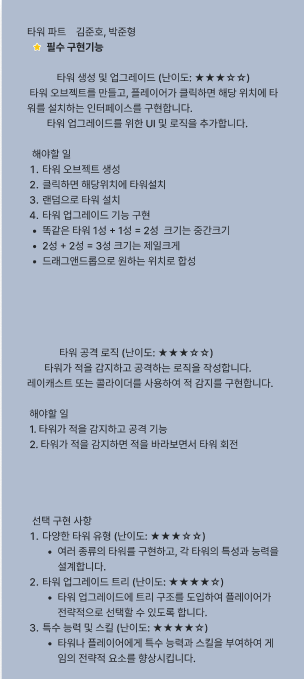

# 34일차 개발일지

## 알고리즘 문제

array의 각 element 중 divisor로 나누어 떨어지는 값을 오름차순으로 정렬한 배열을 반환하는 함수, solution을 작성해주세요.
divisor로 나누어 떨어지는 element가 하나도 없다면 배열에 -1을 담아 반환하세요.

```C#
using System;
using System.Collections.Generic;

public class Solution
{
    public int[] solution(int[] arr, int divisor) 
    {
        List<int> resultList = new List<int>();

        // 배열에서 divisor로 나누어 떨어지는 값을 찾기
        foreach (int num in arr)
        {
            if (num % divisor == 0)
            {
                resultList.Add(num);
            }
        }

        // divisor로 나누어 떨어지는 값이 없으면 -1을 담은 배열 반환
        if (resultList.Count == 0)
        {
            return new int[] { -1 };
        }

        // 나누어 떨어지는 값들을 오름차순으로 정렬
        resultList.Sort();

        // List를 배열로 변환하여 반환
        return resultList.ToArray();
    }
}
```

```C#
List<int> resultList = new List<int>(); 
```

 1. 나누어 떨어지는 값을 담을 리스트를 생성합니다.

```C#
foreach (int num in arr) 
```

2. 배열을 순회하며 각 요소를 확인합니다.

```C#
if (num % divisor == 0) 
```

3. 현재 요소가 divisor로 나누어 떨어지는지 확인합니다.
나누어 떨어지는 경우, 해당 요소를 resultList에 추가합니다.

```C#
if (resultList.Count == 0) 
```
4. 만약 나누어 떨어지는 값이 하나도 없으면 -1이 담긴 배열을 반환합니다.

```C#
resultList.Sort(); 
```
5. 나누어 떨어지는 값들을 오름차순으로 정렬합니다.

```C#
resultList.ToArray(); 
```
 6. 리스트를 배열로 변환하여 반환합니다.

 ## foreach문

 베열, 리스트 등의 컬렉션에서 각요소들을 순회하는 반복문

 ## Sort()

 Sort() 메서드를 사용하면 [1, 2, 3, 5, 8]과 같이 작은 값부터 큰 값 순서로 정렬됩니다.

 ## ToArray()

 ToArray() 메서드를 사용하면 List<T>에 담긴 요소들을 새로운 배열로 만들어줍니다.

 예를 들어, resultList에 [3, 6, 9]라는 값들이 들어 있다면 resultList.ToArray()는 [3, 6, 9]라는 값을 가진 배열을 반환합니다.


## 유니티 팀프로젝트

새로운 팀프로젝트가 발제가 되었고 우리팀은 타워디펜스류 게임을 만들기로 했다. 피그마로 팀원들과 소통해서 어떤 기능이 필요하고 어떤식으로 만들면 좋겠는지 상의를 했다.

나는 타워오브젝트를 맞기로 했는데 필수구현기능 위주로 해야할 것들을 적어봤다. 잘할수 있을지 모르겠지만 차근차근 해봐야지

 